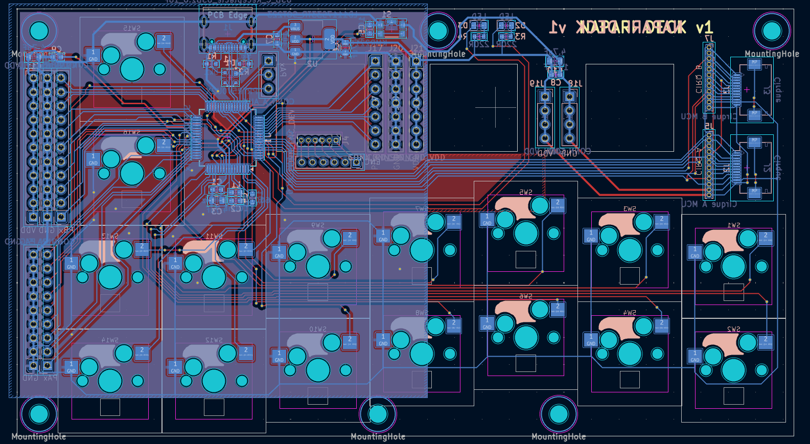

Napari Deck Hardware
====================

The Napari Deck is a custom keyboard-like USB HID input device with keys,
sliders, encoders and trackpads.  It is optimised for controlling [napari],
a multi-dimensional image viewer.

This repository contains the hardware design files needed to build a Napari
Deck: parts lists, 3D printed housing files and PCB design files.

Deck v1
-------

Napari Deck v1 is the first iteration of the housing and inputs (encoders, sliders,
buttons).  It is used to evaluate the inputs and the general layout of the deck.

It has the following inputs:
- mini trackball at the thumb position
- two keyboard switches
- two encoders
- iPod-like dial with encoder and five buttons
- mini joystick
- a slider (linear potentiometer)

Deck v2
-------

Napari Deck v2 is the second iteration of the housing and inputs, and is a fully
functional USB HID device that works with napari using `napari-deck-plugin`.

It has the following inputs:
- mini joystick at the thumb position for 3D rotation
- mini trackball at the thumb position for panning
- two encoders at the thumb position for rotation and zoom
- 16 keyboard switches
- three encoders for 3-axis slicing
- two sliders for opacity and brush size
- two sliders combined with a selection switch for four clipping planes

Deck mini
---------

Napari Deck Mini is a small device used to evaluate a mini trackpad and an encoder.
It is fully functional and works with napari.

It has the following inputs:
- mini trackpad
- encoder

Deck v3
-------

Napari Deck v3 is the third iteration of the housing and inputs.  It has a custom
PCB to simplify the construction, with a built-in STM32G0B1 microcontroller.

It has the following inputs:
- two mini trackpads at the thumb position for 2D panning and 3D rotation
- two encoders at the thumb position for zoom and 3D rotation
- 16 keyboard switches
- three encoders for 3-axis slicing
- two sliders for opacity and brush size
- two sliders combined with a 4-way selection switch for eight clipping planes

Deck v3 is currently a work-in-progress.

[napari]: https://github.com/napari/napari
